# VeeaStats

A hardware monitor for Linux with nine skins and an in-game overlay. See your CPU, memory and GPU load and temperatures at a glance, check how full your drives are, and press **Ctrl+Shift+O** in a game to put those numbers in the corner of the screen.

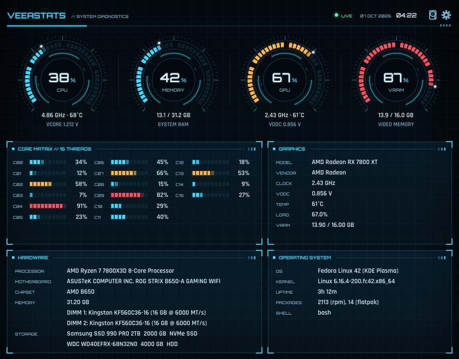

## Features

- **In-game overlay:** press Ctrl+Shift+O to show CPU, memory and GPU load, plus CPU and GPU temperature and voltage, at the top-left of the game you're playing. It's see-through, never takes focus, and lets clicks through to the game.
- **Nine skins:** Classic, JARV, Galactic Conflict, Federation Gunship, Halloween, Poseidon, Otaku, Cyber-Punk and Classroom. The overlay matches whichever skin you pick, and Classroom follows your desktop's light or dark style and accent colour.
- **Live readings:** load per CPU core, CPU clock, voltage (VCore) and temperature, memory, and GPU load, VRAM, clock, voltage and temperature, updated every 250 ms to 2 seconds. Temperatures show in °C or °F.
- **Storage usage:** click the hard-drive button at the top right to list your drives, then pick one to see a pie chart of its used and free space.
- **Hardware details:** processor, motherboard and chipset, memory modules, drives, operating system, kernel, uptime and installed packages.
- **All the major GPUs:** AMD, Intel and NVIDIA (through its driver's `nvidia-smi` tool), plus ARM Mali when built from source on ARM boards. With several GPUs, the busiest one is shown.
- **Runs in the background if you want:** close the window and the overlay hotkey keeps working.
- **Light on your PC:** VeeaStats reads its live numbers straight from the kernel instead of running other programs, and sleeps between updates. Hidden and idle, it uses practically no CPU.
- **One file, installs itself:** a single AppImage that adds itself to your app menu. It needs no root password, except for the optional voltage sensor setup.

## The in-game overlay

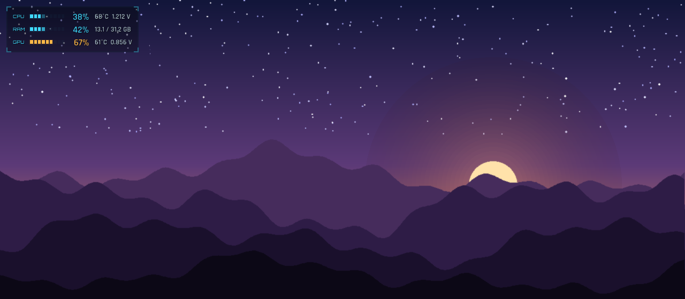

Press **Ctrl+Shift+O** in a game to show the overlay; press it again to hide it.

By default the overlay belongs to the game you opened it in. It hides while you switch to another window, comes back when you return, and closes on its own when the game closes. To keep it on screen whatever you're doing, turn off **Limit Overlay to Focused App** in the gear menu: the overlay then stays in the top-left corner of your main screen, below any top bar.

The overlay takes on the look of the active skin:

<table>
  <tr>
    <td>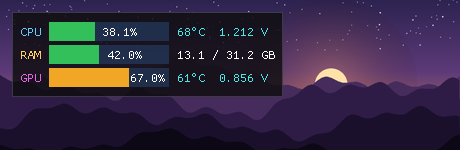<br>Classic</td>
    <td>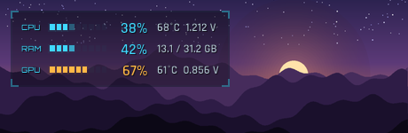<br>JARV</td>
  </tr>
  <tr>
    <td>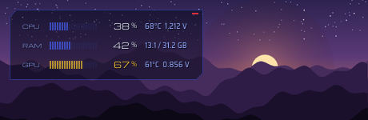<br>Galactic Conflict</td>
    <td>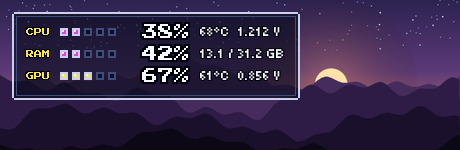<br>Federation Gunship</td>
  </tr>
  <tr>
    <td>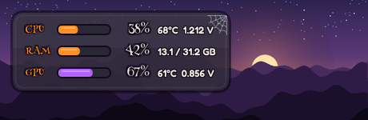<br>Halloween</td>
    <td>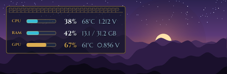<br>Poseidon</td>
  </tr>
  <tr>
    <td>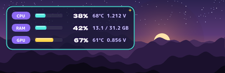<br>Otaku</td>
    <td>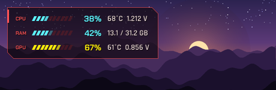<br>Cyber-Punk</td>
  </tr>
  <tr>
    <td>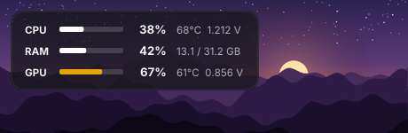<br>Classroom</td>
    <td></td>
  </tr>
</table>

**Where the hotkey works:**

| Desktop | Ctrl+Shift+O works in |
|---|---|
| GNOME 48 or newer, KDE Plasma 6 | Every app. The first time, your desktop asks you to confirm the shortcut. |
| Older GNOME and KDE, and other Wayland desktops | X11 apps, which includes Proton and Wine games |
| Any X11 session | Every app |

The overlay can follow Proton and Wine games and other X11 apps. Native Wayland apps, such as Firefox on GNOME, don't tell other programs where their windows are. So with **Limit Overlay to Focused App** on, the hotkey does nothing in them; with it off, the overlay shows in the screen corner.

## Storage usage

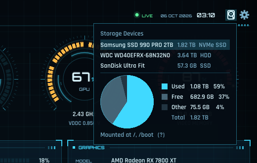

Click the hard-drive button next to the gear (hover over it for **View Storage Usage Stats**) to list every storage device connected to your PC, including USB drives. Click a drive to see a pie chart of its total, used and free space, and where it's mounted. Click the drive again to hide its chart, or anywhere else to close the menu.

- **Used** and **Free** add up the space on every partition of the drive that's mounted. Linux can only measure the space inside mounted partitions.
- **Other** is the rest of the drive: partitions that aren't mounted (a Windows partition, for example), unpartitioned space, and space the filesystem keeps for itself.
- A drive with nothing mounted shows as **Not mounted**.

The numbers refresh every 2 seconds while the menu is open.

## Skins

Pick a skin from the gear menu at the top right. Every skin except Classic is animated (turning rings, blinking lights, numbers that glide to new values); turn **Animations** off for a still display.

<table>
  <tr>
    <td>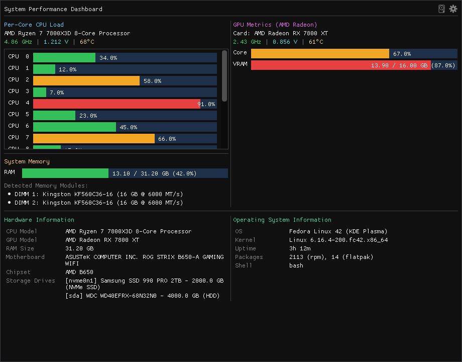<br><b>Classic</b>: the original Dear ImGui look</td>
    <td><br><b>JARV</b>: a holographic heads-up display with glowing cyan gauges</td>
  </tr>
  <tr>
    <td>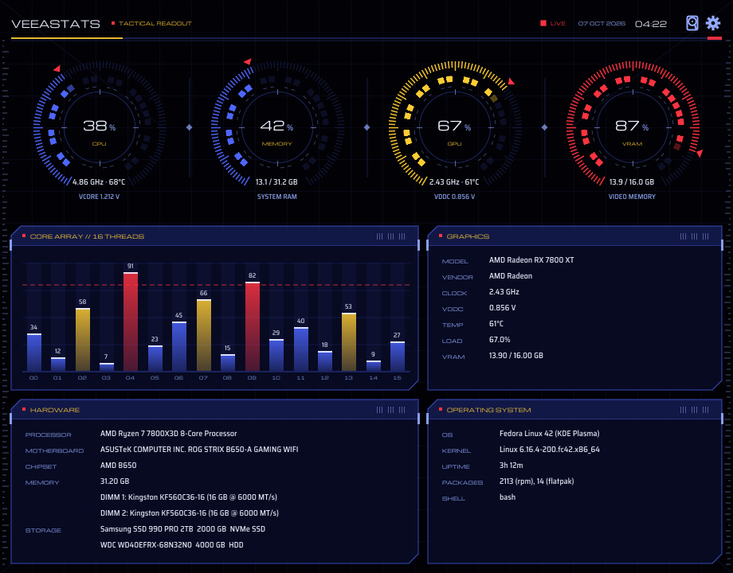<br><b>Galactic Conflict</b>: a starship tactical display with targeting dials</td>
    <td>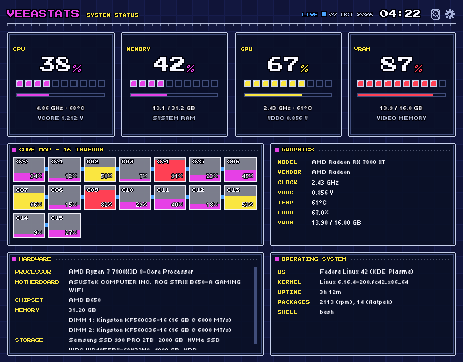<br><b>Federation Gunship</b>: handheld-console pixel art with energy tanks</td>
  </tr>
  <tr>
    <td>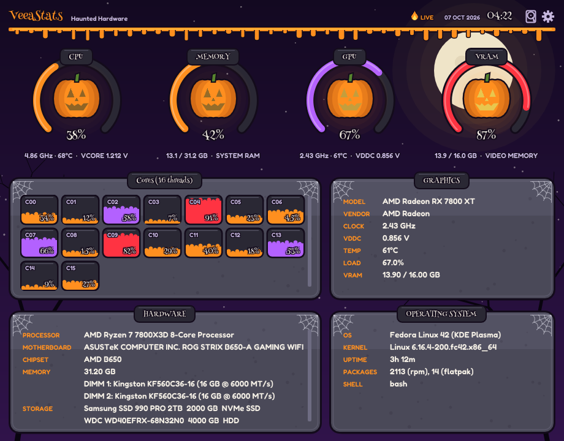<br><b>Halloween</b>: stone slabs, cobwebs and glowing jack-o'-lanterns</td>
    <td>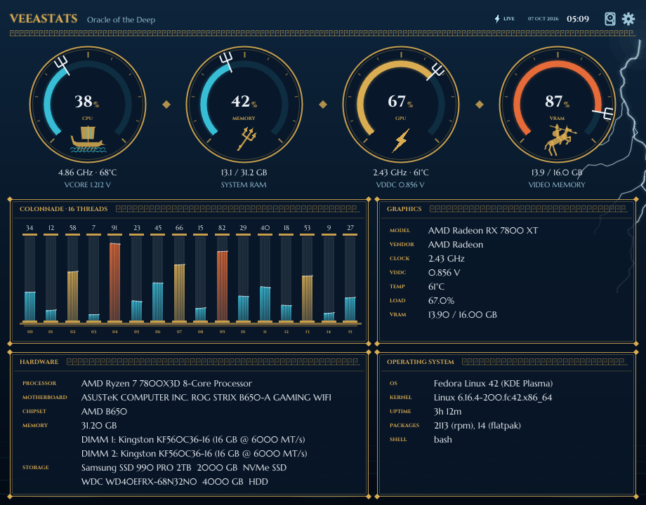<br><b>Poseidon</b>: a stormy sea temple with gold Greek key trim, bronze shields with black-figure scenes, and lightning</td>
  </tr>
  <tr>
    <td>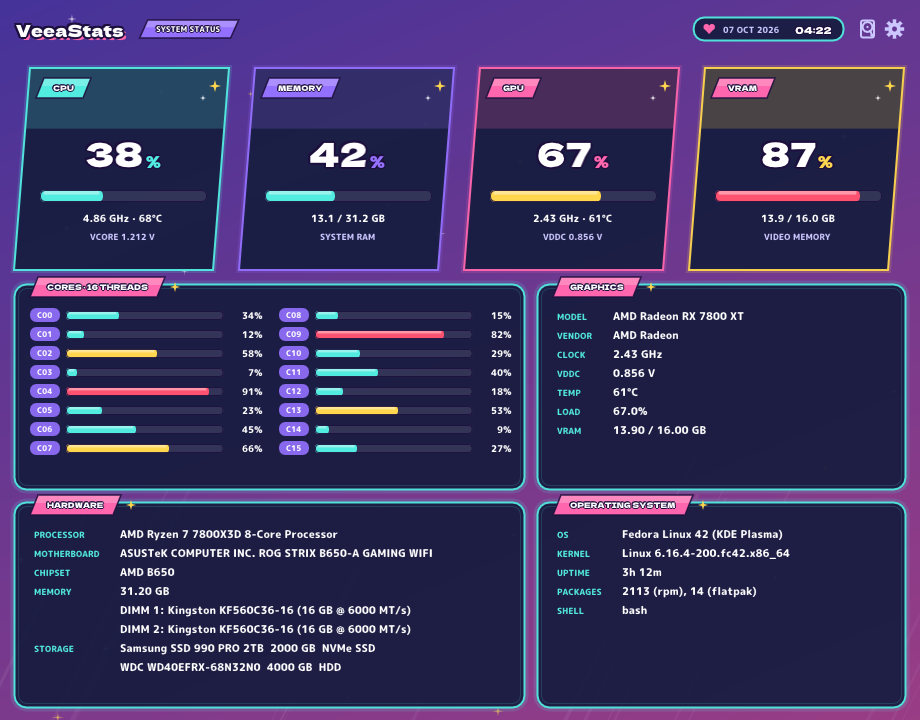<br><b>Otaku</b>: an anime game menu with tilted character cards and candy-coloured stat bars</td>
    <td>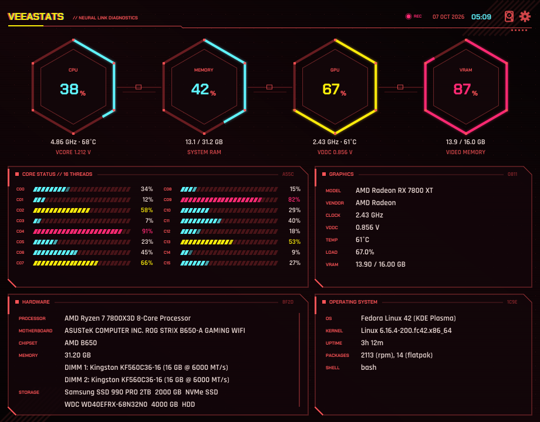<br><b>Cyber-Punk</b>: a neon-city HUD with hexagon gauges and a glitching title</td>
  </tr>
  <tr>
    <td>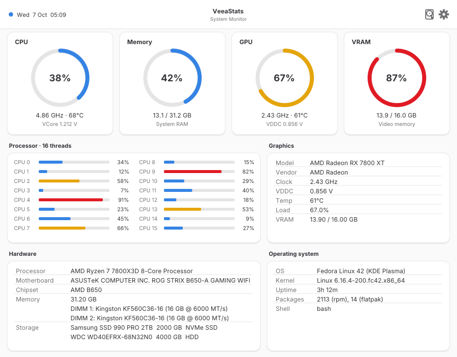<br><b>Classroom</b>: a clean desktop look in the style of GNOME apps, light or dark to match your desktop, in your accent colour</td>
    <td></td>
  </tr>
</table>

The screenshots show sample data from a demonstration PC.

## Install

VeeaStats runs on any 64-bit (x86_64) Linux with glibc 2.34 or newer, on GNOME, KDE Plasma and other desktops, with Wayland or X11. That covers Fedora 35+, Ubuntu 22.04+, Debian 12+, openSUSE Tumbleweed, Arch, and distros based on them. It has been tested on Fedora 42, Ubuntu 24.04, Debian 12, openSUSE Tumbleweed and Arch.

**From a terminal:**

```sh
curl -fsSL https://raw.githubusercontent.com/GuestVeea/VeeaStats/main/install.sh | sh
```

This downloads the latest release and installs it for your user; don't run it with `sudo`. If you don't have `curl`, use `wget -qO- <same address> | sh`.

**By hand:** download `VeeaStats-x86_64.AppImage` from the [latest release](https://github.com/GuestVeea/VeeaStats/releases/latest), make it executable (right-click → Properties → Permissions, or `chmod +x VeeaStats-x86_64.AppImage`), and open it.

Either way, VeeaStats installs itself into `~/.local/share/veeastats` and adds itself to your app menu. Opening a newer AppImage later updates it.

**CPU voltage:** many desktop motherboards report VCore through a sensor chip whose driver Linux doesn't load by itself. On first launch, VeeaStats offers to turn it on (Nuvoton `nct6775` or ITE `it87`). That's the one step that asks for your password, and you can say no. Laptops are never asked.

**Uninstall:** right-click VeeaStats in your app menu and choose **Uninstall VeeaStats**, or run:

```sh
curl -fsSL https://raw.githubusercontent.com/GuestVeea/VeeaStats/main/install.sh | sh -s -- --uninstall
```

## Settings

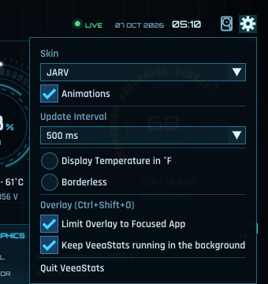

The gear button at the top right opens the settings. Click the gear again, or anywhere else, to close it.

| Setting | What it does |
|---|---|
| Skin | Changes the look of the window and the overlay |
| Animations | Turns the moving parts of the animated skins on or off |
| Update Interval | How often the numbers refresh: 250 ms to 2 seconds (500 ms by default) |
| Display Temperature in °F | Shows temperatures in Fahrenheit instead of Celsius. Click it again to go back to Celsius. |
| Borderless | Hides the window's title bar and border. Move the window by holding Super and dragging it; close it with Alt+F4. Click it again to bring the border back. |
| Limit Overlay to Focused App | On: the overlay opens on the focused game and follows it. Off: it stays in the screen corner. |
| Keep VeeaStats running in the background | Closing the window hides it instead of quitting, so Ctrl+Shift+O keeps working. Open VeeaStats from the app menu to bring the window back, or choose **Quit VeeaStats** in this menu. |

Settings are saved in `~/.config/veeastats/settings.conf`.

## Privacy

VeeaStats never connects to the internet. It reads your hardware information locally, from `/proc` and `/sys`, and keeps it on your PC. (`install.sh` downloads the AppImage from this repository's releases, and that's all.)

## Build from source

You need a C++17 compiler, CMake, pkg-config, and the development files for OpenGL, X11, Wayland and GLib:

```sh
# Fedora
sudo dnf install gcc-c++ cmake pkgconf mesa-libGL-devel libX11-devel libXrandr-devel libXinerama-devel \
    libXcursor-devel libXi-devel libxkbcommon-devel wayland-devel glib2-devel
# Ubuntu / Debian
sudo apt install build-essential cmake pkg-config libgl-dev libx11-dev libxrandr-dev libxinerama-dev \
    libxcursor-dev libxi-dev libxkbcommon-dev libwayland-dev libwayland-bin libglib2.0-dev
# Arch
sudo pacman -S --needed base-devel cmake mesa libx11 libxrandr libxinerama libxcursor libxi libxkbcommon wayland glib2
```

Then:

```sh
git clone --recursive https://github.com/GuestVeea/VeeaStats.git
cd VeeaStats
cmake -S . -B build
cmake --build build -j
./build/CpuMonitor
```

`--recursive` also fetches Dear ImGui, which is included as a submodule. GLFW is downloaded and built in during the first CMake run.

To build the release AppImage, run `packaging/build-appimage.sh --container`. It builds inside an Ubuntu 22.04 container (with Podman or Docker), so the result runs on older distros too.

## License

VeeaStats is free software under the [GNU General Public License v3.0](LICENSE).

It's built with [Dear ImGui](https://github.com/ocornut/imgui) (MIT license) and [GLFW](https://www.glfw.org/) (zlib license). The skins use fonts released under the SIL Open Font License: Orbitron, Rajdhani, Michroma, Saira Semi Condensed, Press Start 2P, Tiny5, Henny Penny, Fredoka, Cinzel, Marcellus, Dela Gothic One, M PLUS Rounded 1c, Chakra Petch and Inter. See [fonts/README.md](fonts/README.md) for details and licenses.
